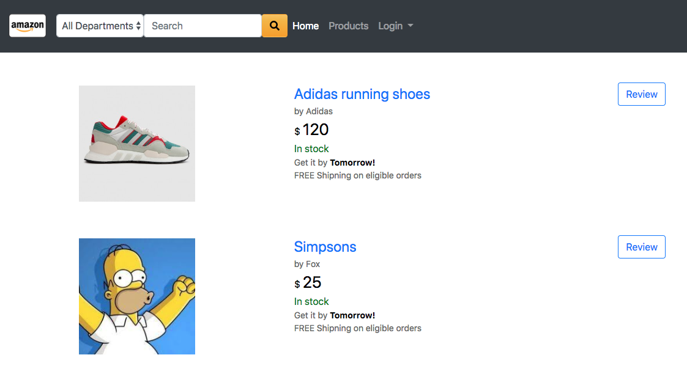

# AMAZON CLONE PAGE

This is Amazon clone site.

## Getting Started

### Prerequisites

node.js and node package manager (npm) shall be installed.

### Installing

After clone to your local repo.

```javascripts
npm install
```

Then, run app

```
node app.js
```

### Product image



### Following is the folder structure.

```bash
├── app.js
├── bin
│ └── www
├── db
│ └── mongoose.js
├── models
│ └── inventory.js
│ └── user.js
├── package.json
├── public
│ ├── images
│ ├── javascripts
│ └── stylesheets
│     └── style.css
├── routes
│ ├── index.js
│ └── users.js
│ └── inventories.js
└── views
│ └── partial──navbar.hbs
│ └── review──user_review.hbs
│ └── cart.hbs
│ └── home.hbs
│ └── index.hbs
│ └── inventory-edit.hbs
│ └── inventory.hbs
│ └── layout.hbs
│ └── login.hbs
│ └── purchase.hbs
│ └── register.hbs
├── error.hbs
├── index.hbs
└── layout.hbs
└── package.json
└── Procfile
└── README
```

## Features implemented

- **Secure login** - login by using Passport.JS local strategy
- **Item search** - by item name, by item tag in department
- **Item purchase** - add item(s) to cart, change qty after in cart.
- **Item review** - review item(s) and grade

## Running the tests

Automated test is not implement here. Future improvment

## Deployment

Use Heroku to deploy,

## Built the following major node packages,

- [Node.js](https://nodejs.org/) - Node.js
- [Express.js](https://expressjs.com) - Web framework for node.js
- [Handlebars.js](https://handlebarsjs.com) - Node.js web framework
- [Mongoose.js](https://mongoosejs.com) - Object modeling for node.js
- [Passport.js](http://www.passportjs.org) - Authentication for node.js
- Mlab database (https://mlab.com) - mongodb deployment.

## Versioning

## Authors

- **Maryam** **Ming** **Tri** **Chan**- _Initial work_
  https://github.com/kmaryam27
  https://github.com/tnguyen303
  https://github.com/sandy8111112004
  https://github.com/moz5691

## License

This project is licensed under the MIT License - see the [LICENSE.md](LICENSE.md) file for details

## Acknowledgments

- CJ Jordan and Hannah Patellis, our bootcamp teachers.
- Arturo Salmeron, our TA

## Note

This project includes images from Amazon sites. All copywright of images from Amazon site belongs to Amazon.
